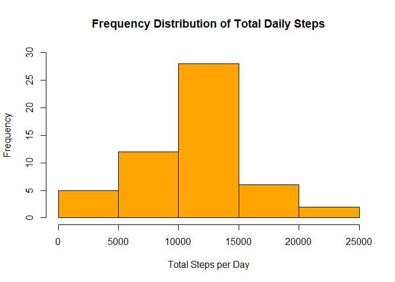
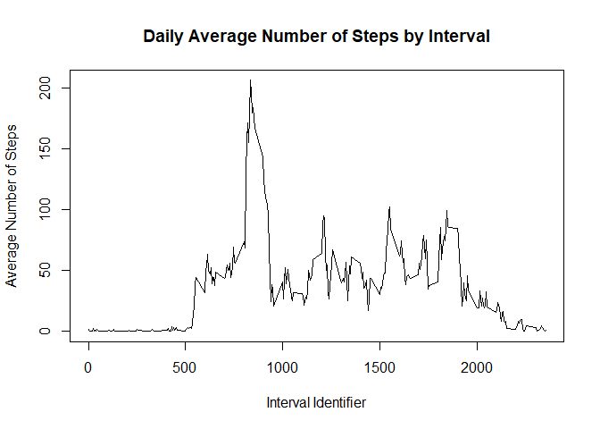
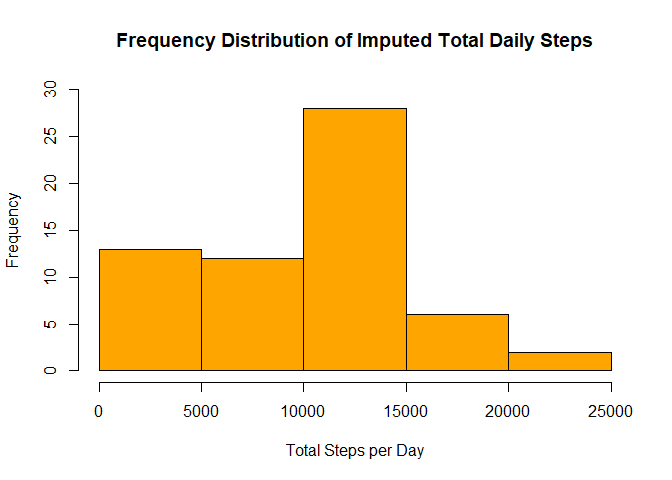
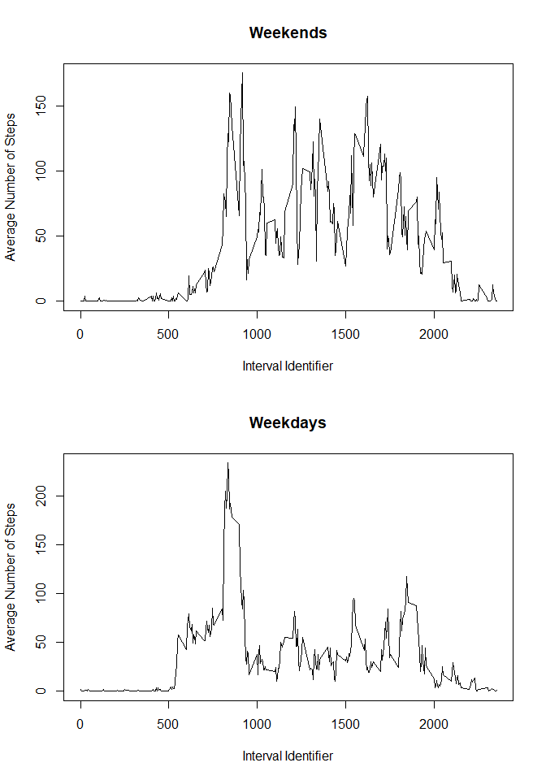

# Reproducible Research: Peer Assessment 1


This is my assignment for week 2 of the Coursera course Reproducible Research,
submitted 17-September 2017.

All analyses and this markdown document were done using RStudio version 1.0.153
in run as administrator mode on a Windows 10 PC and with R version 3.4.1.

This assignment uses data from a personal activity monitoring device that
counted the number of steps taken by a single individual over 5-minute
intervals throughout the day for two months in 2012 (October and November).

The data and associated materials were obtained by forking the Github repository
located at "https://github.com/rdpeng/RepData_PeerAssessment1" and cloning it
into the current working directory.


##Loading and Preprocessing the Data

The following code extracts the data from the zip file and loads it into R. It also
transforms the date variable into date format.


```r
unzip("activity.zip", exdir = "RepData_PeerAssessment1")
stepData <- read.csv("activity.csv", stringsAsFactors = FALSE)
stepData$date <- as.Date(stepData$date)
```

Here I load the packages that I will be using. For this process only, I turn off messages
and warnings to avoid package loading messages from appearing in the output HTML document.


```r
library(knitr)
library(dplyr)
```

##What Is the Mean Total Number of Steps Taken per Day?

The first part of the assignment asks "what is the mean total number of steps
taken per day?" It requires that the output be a histogram of the daily total
steps, ignoring NAs, and also report the mean and median total steps per day.

The following code calculates the total number of steps taken daily then creates
a histogram showing the frequency distribution of the total steps taken per day.


```r
totalDailySteps <- with(stepData, tapply(steps, date, sum))
hist(totalDailySteps, main = "Frequency Distribution of Total Daily Steps",
     xlab = "Total Steps per Day", col = "orange", ylim = c(0, 30))
```

<!-- -->

The mean and median number of total steps are calculated with the following
code. I chose to report the mean as an integer because a portion of a step taken
is meaningless.


```r
meanDailySteps <- as.integer(mean(totalDailySteps, na.rm = TRUE))
medianDailySteps <- median(totalDailySteps, na.rm = TRUE)
meanDailySteps
```

```
## [1] 10766
```

```r
medianDailySteps
```

```
## [1] 10765
```

Thus, the mean number of steps taken per day is 10766 and the median
number of steps taken per day is 10765.


##What Is the Average Daily Activity Pattern?

The next part of the assignment asks us to create a time series plot of the
number of steps taken in each interval, averaged across all days, and to
identify which interval, on average, contains the maximum number of steps.

The following code calculates the mean number of steps in each interval then
plots this as a time series plot. It uses the dplyr package, which was loaded
earlier. The identifier for the interval with the maximum average step count
is then calculated.


```r
by_interval <- group_by(stepData, interval)
intervalAvg <- summarize(by_interval, avg_steps = mean(steps, na.rm = TRUE))
with(intervalAvg, plot(interval, avg_steps, type = "l",
                       main = "Daily Average Number of Steps by Interval",
                       xlab = "Interval Identifier",
                       ylab = "Average Number of Steps"))
```

<!-- -->

```r
maxSteps <- intervalAvg[which.max(intervalAvg$avg_steps), ]
maxInterval <- maxSteps$interval
maxInterval
```

```
## [1] 835
```

The identifier of the interval with the maximum number of steps averaged across
all days is 835.


##Imputing Missing Values

This part of the assignment asks that we calculate and report the number of
missing values in the dataset then devise a strategy for filling in the missing
values. We are then asked to fill in the missing values using our strategy and
redo the histogram and calculation of mean and median as in the first part of
the assignment and compare the results.

Here is my code for calculating the number of missing values:


```r
removeNAs <- subset(stepData, steps != "NA")
numberNAs <- nrow(stepData) - nrow(removeNAs)
numberNAs
```

```
## [1] 2304
```

Thus, the total number of missing values in the dataset is 2304.

I have chosen to impute missing values by using the median number of steps for a
given inverval calculated over all days in the dataset. Here is my code for
making that calculation and replacing the NAs in the dataset.


```r
intervalMedian <- summarize(by_interval, median_steps = median(steps, na.rm = TRUE))
stepData2 <- stepData
stepData2$steps[is.na(stepData2$steps)] <- intervalMedian$median_steps[match(stepData2$interval[is.na(stepData2$steps)], intervalMedian$interval)]
```

Here is the code to generate the frequency histogram.


```r
totalDailySteps2 <- with(stepData2, tapply(steps, date, sum))
hist(totalDailySteps2, main = "Frequency Distribution of Imputed Total Daily Steps",
     xlab = "Total Steps per Day", col = "orange", ylim = c(0, 30))
```

<!-- -->

And here is the code to calculate the mean and median total daily step values
using the imputed data.


```r
meanDailySteps2 <- as.integer(mean(totalDailySteps2, na.rm = TRUE))
medianDailySteps2 <- median(totalDailySteps2, na.rm = TRUE)
meanDailySteps2
```

```
## [1] 9503
```

```r
medianDailySteps2
```

```
## [1] 10395
```

So, using the imputed data, the mean number of steps taken per day is 9503 and the median
number of steps taken per day is 10395.

<b>Do these values differ from the estimates in the first part of the assignment?</b>

Yes. Both the median and mean total step values are lower with the imputed data.

<b>What is the impact of imputing missing data on the estimates of the total
daily number of steps?</b>

As seen in the second histogram, the impact of imputing missing data using the
median for a given interval is that the number of days with total steps in the
0-5,000 range increases from 5 to 13. The other step ranges are unchanged.


##Are There Differences in Activity Patterns Between Weekdays and Weekends?

The final part of the assignment asks us to separate the data into weekend and
weekday data by creating a new factor variable. Then, we are asked to create a
panel plot showing time series plots for these two data subsets.

Here is the code that creates the weekend/weekday factor variable.


```r
daysofweek <- c("Monday", "Tuesday", "Wednesday", "Thursday", "Friday")
stepData$weekend_day <- factor((weekdays(stepData$date) %in% daysofweek), 
  levels = c(FALSE, TRUE), labels = c("weekend", "weekday"))
weekendstepData <- stepData[stepData$weekend_day == "weekend", ]
weekdaystepData <- stepData[stepData$weekend_day == "weekday", ]
```

And here is the code to create the panel plot.


```r
weekend_by_interval <- group_by(weekendstepData, interval)
weekend_intervalAvg <- summarize(weekend_by_interval, avg_steps = mean(steps, na.rm = TRUE))
weekday_by_interval <- group_by(weekdaystepData, interval)
weekday_intervalAvg <- summarize(weekday_by_interval, avg_steps = mean(steps, na.rm = TRUE))
par(mfrow = c(2, 1))
with(weekend_intervalAvg, plot(interval, avg_steps, type = "l",
                       main = "Weekends",
                       xlab = "Interval Identifier", 
                       ylab = "Average Number of Steps"))

with(weekday_intervalAvg, plot(interval, avg_steps, type = "l",
                       main = "Weekdays",
                       xlab = "Interval Identifier",
                       ylab = "Average Number of Steps"))
```

<!-- -->

As shown in these plots, there is indeed a difference between weekdays and weekends
in the total number of steps taken per interval, with more steps taken during the day
on weekends.
